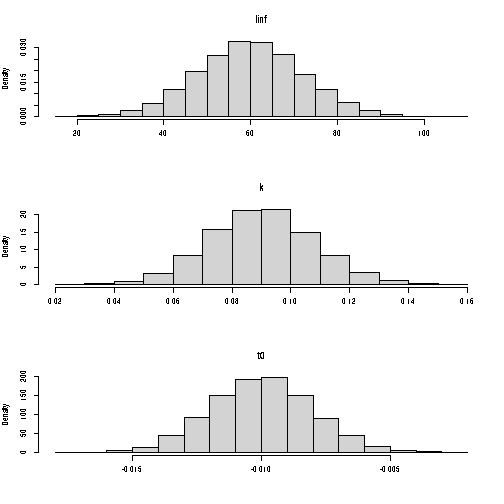
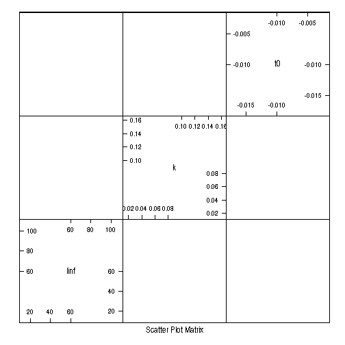
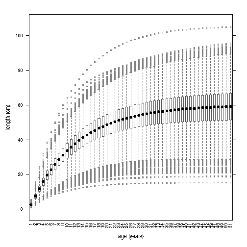
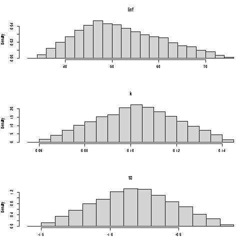
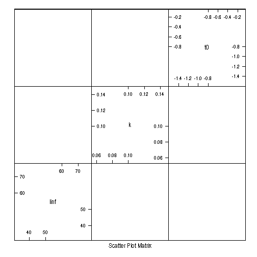
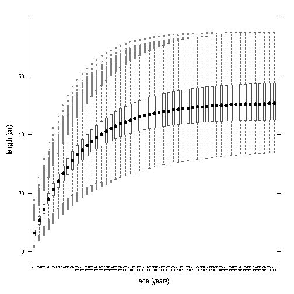
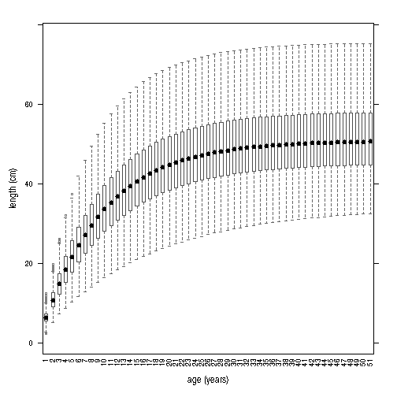

# Modelling Individual Growth and Using Stochastic Slicing to Convert Length-based Data Into Age-based Data


``` r
# libraries
library(devtools)
library(FLa4a)
library(XML)
library(reshape2)
library(ggplotFL)
# datasets
data(ple4)
data(ple4.indices)
data(ple4.index)
data(rfLen)
```

This section explains the approach developed by `a4a` to integrate uncertainty in individual growth into stock assessment and advice. It presents a mixture of text and code, where the first explains the concepts behind the methods, while the last shows how these can be run with the `FLa4a` R package.

The `a4a` stock assessment framework is based on age dynamics. Therefore, to use length information, it must be processed before running the stock assessment model. The rationale is that the processing should give the analyst the flexibility to use a range of sources of information, _e.g._ literature or online databases, to collect information about the species growth model and uncertainty about the model parameters.

The framework allows the analyst to parametrize individual growth, set the assumptions about it and condition the stock assessment model on those decisions. It incentivizes the **uptake** of estimation uncertainty, as well as exploring several parametrizations and/or growth models to deal with structural uncertainty, finally propagating uncertainty into stock assessment.

Within the `a4a` framework this is handled using the `a4aGr` class. In this section we introduce the `a4aGr` class and look at the variety of ways that parameter uncertainty can be included.

## a4aGr - The growth class

The conversion of length data to age is performed through the use of a growth model. The implementation is done through the `a4aGr` class.


``` r
showClass("a4aGr")
```

```
## Class "a4aGr" [package "FLa4a"]
## 
## Slots:
##                                                                             
## Name:      grMod  grInvMod    params      vcov     distr      name      desc
## Class:   formula   formula     FLPar     array character character character
##                 
## Name:      range
## Class:   numeric
## 
## Extends: "FLComp"
```

To construct an `a4aGr` object, the growth model and parameters must be provided. Check the help file for more information.

Here we show an example using the von Bertalanffy growth model. To create the `a4aGr` object it's necessary to pass the model equation ($length \sim time$), the inverse model equation ($time \sim length$) and the parameters. Any growth model can be used as long as it's possible to write the model (and the inverse) as an R formula.


``` r
vbObj <- a4aGr(
	grMod=~linf*(1-exp(-k*(t-t0))),      
	grInvMod=~t0-1/k*log(1-len/linf),      
	params=FLPar(linf=58.5, k=0.086, t0=0.001, units=c("cm","year-1","year"))     
)

# Check the model and its inverse
lc=20
predict(vbObj, len=lc)
```

```
##    iter
##           1
##   1 4.86575
```

``` r
predict(vbObj, t=predict(vbObj, len=lc))==lc
```

```
##    iter
##        1
##   1 TRUE
```

The predict method allows the transformation between age and lengths using the growth model.


``` r
predict(vbObj, len=5:10+0.5)
```

```
##    iter
##            1
##   1 1.149080
##   2 1.370570
##   3 1.596362
##   4 1.826625
##   5 2.061540
##   6 2.301299
```

``` r
predict(vbObj, t=5:10+0.5)
```

```
##    iter
##            1
##   1 22.04376
##   2 25.04796
##   3 27.80460
##   4 30.33408
##   5 32.65511
##   6 34.78488
```

## Adding uncertainty to growth parameters with a multivariate normal distribution}

Uncertainty in the growth model is introduced through the inclusion of parameter uncertainty.
This is done by making use of the parameter variance-covariance matrix (the `vcov` slot of the `a4aGr` class) and assuming a distribution. The numbers in the variance-covariance matrix could come from the parameter uncertainty from fitting the growth model parameters.

Here we set the variance-covariance matrix by scaling a correlation matrix, using a cv of 0.2. Based on 

$$\rho_{x,y}=\frac{\Sigma_{x,y}}{\sigma_x \sigma_y}$$

and 

$$CV_x=\frac{\sigma_x}{\mu_x}$$


``` r
# Make an empty cor matrix
cm <- diag(c(1,1,1))
# k and linf are negatively correlated while t0 is independent
cm[1,2] <- cm[2,1] <- -0.5
# scale cor to var using CV=0.2
cv <- 0.2
p <- c(linf=60, k=0.09, t0=-0.01)
vc <- matrix(1, ncol=3, nrow=3)
l <- vc
l[1,] <- l[,1] <- p[1]*cv
k <- vc
k[,2] <- k[2,] <- p[2]*cv
t <- vc
t[3,] <- t[,3] <- p[3]*cv
mm <- t*k*l
diag(mm) <- diag(mm)^2
mm <- mm*cm
# check that we have the intended correlation
all.equal(cm, cov2cor(mm))
```

```
## [1] TRUE
```

Create the a4aGr object as before but now we also include the vcov argument for the variance-covariance matrix.


``` r
vbObj <- a4aGr(grMod=~linf*(1-exp(-k*(t-t0))), grInvMod=~t0-1/k*log(1-len/linf), 
               params=FLPar(linf=p["linf"], k=p["k"], t0=p["t0"], 
                            units=c("cm","year-1","year")), vcov=mm)
```

First we show a simple example where we assume that the parameters are represented using a multivariate normal distribution.
% This covariance matrix can have iterations (i.e. each iteration can have a different covariance matrix). CHECK
% If the parameters or the covariance matrix have iterations then the medians accross iterations are computed before simulating. Check help for `mvrnorm} for more information.


``` r
# Note that the object we have just created has a single iteration of each parameter
vbObj@params
```

```
## An object of class "FLPar"
## params
##  linf     k    t0 
## 60.00  0.09 -0.01 
## units:  cm year-1 year
```

``` r
dim(vbObj@params)
```

```
## [1] 3 1
```

``` r
# We simulate 10000 iterations from the a4aGr object by calling mvrnorm() using the 
# variance-covariance matrix we created earlier.
vbNorm <- mvrnorm(10000,vbObj)
# Now we have 10000 iterations of each parameter, randomly sampled from the 
# multivariate normal distribution
vbNorm@params
```

```
## An object of class "FLPar"
## iters:  10000 
## 
## params
##                 linf                    k                   t0 
## 59.9442996(11.92329)  0.0899475( 0.01782) -0.0099725( 0.00198) 
## units:  cm year-1 year
```

``` r
dim(vbNorm@params)
```

```
## [1]     3 10000
```

We can now convert from length to ages data based on the 10000 parameter iterations. This gives us 10000 sets of age data. For example, here we convert a single length vector using each of the 10000 parameter iterations: 


``` r
ages <- predict(vbNorm, len=5:10+0.5)
dim(ages)
```

```
## [1]     6 10000
```

``` r
# We show the first ten iterations only as an illustration
ages[,1:10]
```

```
##    iter
##            1        2         3        4        5        6        7         8
##   1 1.437818 1.072240 0.8269517 1.278931 1.262276 1.278660 1.257709 0.9357108
##   2 1.724249 1.278863 0.9866959 1.525520 1.505670 1.526450 1.504055 1.1165877
##   3 2.018730 1.488902 1.1490064 1.776263 1.753029 1.778810 1.755786 1.3003382
##   4 2.321727 1.702472 1.3139671 2.031304 2.004487 2.035913 2.013141 1.4870549
##   5 2.633746 1.919695 1.4816659 2.290792 2.260179 2.297941 2.276379 1.6768354
##   6 2.955342 2.140697 1.6521954 2.554885 2.520253 2.565085 2.545773 1.8697817
##    iter
##            9       10
##   1 1.739179 1.083649
##   2 2.100143 1.294823
##   3 2.477153 1.510168
##   4 2.871702 1.729854
##   5 3.285502 1.954058
##   6 3.720528 2.182971
```

The marginal distributions can be seen in Figure \@ref(fig:plot_norm_params).



The shape of the correlation can be seen in Figure \@ref(fig:plot_norm_scatter).



Growth curves for the 1000 iterations can be seen in Figure \@ref(fig:plot_mv_growth).



## Adding uncertainty to growth parameters with a multivariate triangle distribution}
\label{sec:growth_triangle_cop}

One alternative to using a normal distribution is to use a [triangle distribution](http://en.wikipedia.org/wiki/Triangle\_distribution). We use the package [`triangle`](http://cran.r-project.org/web/packages/triangle/index.html) where this distribution is parametrized using the minimum, maximum and median values. This can be very attractive if the analyst needs to scrape information from the web or literature and perform some kind of meta-analysis.

Here we show an example of setting a triangle distribution with values taken from Fishbase.


``` r
# The web address for the growth parameters for redfish (Sebastes norvegicus)
addr <- "https://fishbase.se/PopDyn/PopGrowthList.php?ID=501"
# Scrape the data
tab <- try(readHTMLTable(addr))
```

```
## Error : XML content does not seem to be XML: ''
```

``` r
# Load local copy if no web
if(is(tab, "try-error"))
  load("data/tab.RData")
# Interrogate the data table and get vectors of the values
linf <- as.numeric(as.character(tab$dataTable[,2]))
k <- as.numeric(as.character(tab$dataTable[,4]))
t0 <- as.numeric(as.character(tab$dataTable[,5]))
# Set the min (a), max (b) and median (c) values for the parameter as a list of lists
# Note that t0 has no 'c' (median) value. This makes the distribution symmetrical
triPars <- list(list(a=min(linf), b=max(linf), c=median(linf)),
             list(a=min(k), b=max(k), c=median(k)),
             list(a=median(t0, na.rm=T)-IQR(t0, na.rm=T)/2, b=median(t0, na.rm=T)+
                    IQR(t0, na.rm=T)/2))
# Simulate 10000 times using mvrtriangle
vbTri <- mvrtriangle(10000, vbObj, paramMargins=triPars)
```

The marginals will reflect the uncertainty on the parameter values that were scraped from [Fishbase](http://fishbase.org) but, as we don't really believe the parameters are multivariate normal, here we adopted a distribution based on a _t_ copula with triangle marginals. The marginal distributions can be seen in Figure \@ref(fig:plot_tri_params) and the shape of the correlation can be seen in Figure \@ref(fig:plot_tri_scatter).





We can still use `predict()` to see the growth model uncertainty (Figure \@ref(fig:plot_tri_growth)).



Remember that the above examples use a variance-covariance matrix that we essentially made up. An alternative would be to scrape the entire growth parameters dataset from Fishbase and compute the shape of the variance-covariance matrix yourself.

## Adding uncertainty to growth parameters with statistical copulas}

A more general approach to adding parameter uncertainty is to make use of [statistical copulas](http://www.encyclopediaofmath.org/index.php/Copula) and marginal distributions of choice. This is possible with the `mvrcop()` function borrowed from the package [`copula`](http://cran.r-project.org/web/packages/copula/). The example below keeps the same parameters and changes only the copula type and family but a lot more can be done. Check the package `copula` for more information. 

% Needs more explanation


``` r
vbCop <- mvrcop(10000, vbObj, copula="archmCopula", family="clayton", param=2, 
                margins="triangle", paramMargins=triPars)
```

The shape of the correlation changes (Figure \@ref(fig:plot_cop_tri_scatter)) as well as the resulting growth curves (Figure \@ref(fig:plot_cop_tri_growth)). 




## Converting from length to age based data - the `l2a()` method}

After introducing uncertainty in the growth model through the parameters it's time to transform the length-based dataset into an age-based dataset. The method that deals with this process is `l2a()`. The implementation of this method for the `FLQuant` class is the main workhorse. There are two other implementations, for the `FLStock` and `FLIndex` classes, which are mainly wrappers that call the `FLQuant` method several times.

When converting from length-based data to age-based data you need to be aware of how the aggregation of length classes is performed. For example, individuals in length classes 1-2, 2-3, and 3-4 cm may all be considered as being of age 1 (obviously depending on the growth model). How should the values in those length classes be combined?

If the values are abundances then the values should be summed. Summing other types of values, such as mean weight, does not make sense. Instead these values are averaged over the length classes (possibly weighted by the abundance). This is controlled using the `stat` argument which can be either `mean` or `sum` (the default). Fishing mortality is not computed to avoid making wrong assumptions about the meaning of F at length.

We demonstrate the method by converting a catch-at-length `FLQuant` to a catch-at-age `FLQuant`. First we make an `a4aGr` object with a multivariate triangle distribution (using the parameters we set above). We use 10 iterations as an example. And call `l2a()` by passing in the length-based `FLQuant` and the `a4aGr` object.


``` r
vbTriSmall <- mvrtriangle(10, vbObj, paramMargins=triPars)
cth.n <- l2a(catch.n(rfLen.stk), vbTriSmall)
```

```
## Warning in log(1 - len/linf): NaNs produced
## Warning in log(1 - len/linf): NaNs produced
## Warning in log(1 - len/linf): NaNs produced
## Warning in log(1 - len/linf): NaNs produced
## Warning in log(1 - len/linf): NaNs produced
## Warning in log(1 - len/linf): NaNs produced
## Warning in log(1 - len/linf): NaNs produced
## Warning in log(1 - len/linf): NaNs produced
```


``` r
dim(cth.n)
```

```
## [1] 59 26  1  4  1 10
```

In the previous example, the `FLQuant` object that was sliced (`catch.n(rfLen.stk)`) had only one iteration. This iteration was sliced by each of the iterations in the growth model. It is possible for the `FLQuant` object to have the same number of iterations as the growth model, in which case each iteration of the `FLQuant` and the growth model are used together. It is also possible for the growth model to have only one iteration while the `FLQuant` object has many iterations. The same growth model is then used for each of the `FLQuant` iterations. As with all `FLR` objects, the general rule is _one or n_ iterations.

As well as converting one `FLQuant` at a time, we can convert entire `FLStock` and `FLIndex` objects. In these cases the individual `FLQuant` slots of those classes are converted from length-based to age-based. As mentioned above, the aggregation method depends on the type of values the slots contain. The abundance slots (`*.n`, such as `stock.n`) are summed. The `*.wt`, `m`, `mat`, `harvest.spwn` and `m.spwn` slots of an `FLStock` object are averaged. The `catch.wt` and `sel.pattern` slots of an `FLIndex` object are averaged, while the `index`, `index.var` and `catch.n` slots are summed. 

The method for `FLStock` classes takes an additional argument for the plusgroup.


``` r
aStk <- l2a(rfLen.stk, vbTriSmall, plusgroup=14)
```

```
## Warning in .local(object, model, ...): Individual weights, M and maturity will be (weighted) averaged accross lengths,
##  harvest is not computed and everything else will be summed.
##  If this is not what you want, you'll have to deal with these slots by hand.
```

```
## Warning in .local(object, model, ...): Some ages are less than 0, indicating a mismatch between input data lengths
##  and growth parameters (possibly t0)
```

```
## Warning in .local(object, model, ...): Trimming age range to a minimum of 0
```

```
## [1] "maxfbar has been changed to accomodate new plusgroup"
```

``` r
aIdx <- l2a(rfTrawl.idx, vbTriSmall)
```

```
## Warning in l2a(rfTrawl.idx, vbTriSmall): Some ages are less than 0, indicating a mismatch between input data lengths
##  and growth parameters (possibly t0)
```

```
## Warning in l2a(rfTrawl.idx, vbTriSmall): Trimming age range to a minimum of 0
```

When converting with `l2a()` all lengths above Linf are converted to the maximum age, as there is no information in the growth model about how to deal with individuals larger than Linf. 

