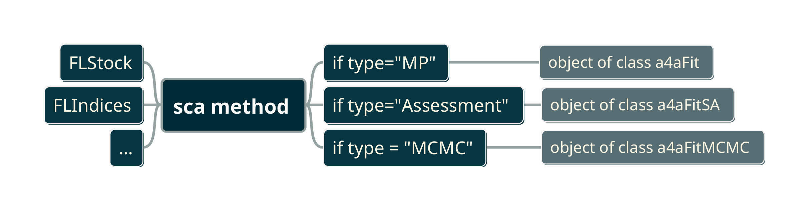
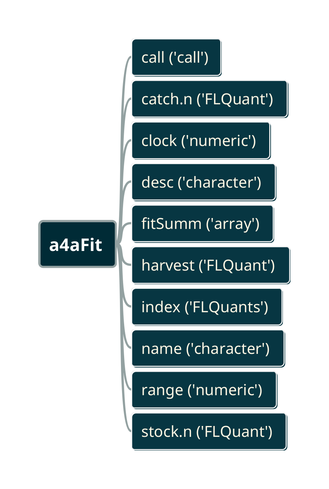
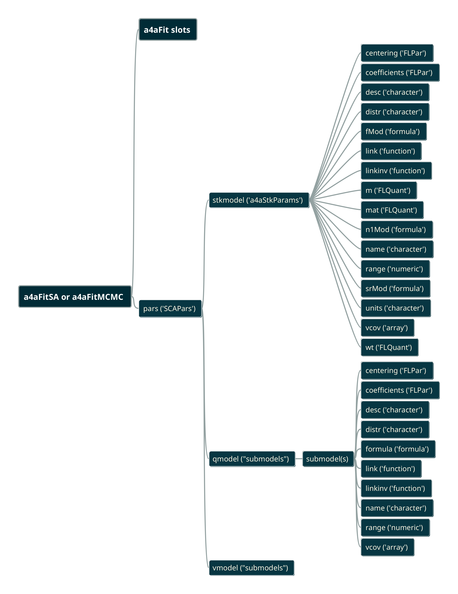

# Stock assessment framework

## Maths description \label{sec:math}

The stock assessment model behind the framework is based in two main equations to link observations to processes, the Baranov's catch equation and abundance indices equation.

Catches in numbers by age and year are defined in terms of the three quantities: natural mortality, fishing mortality and recruitment; using a modified form of the well known Baranov catch equation:

$$C_{ay} = \frac{F_{ay}}{F_{ay}+M_{ay}}\left(1 - e^{-(F_{ay}+M_{ay})}\right) R_{y}e^{-\sum (F_{ay} + M_{ay})} $$

Survey indices by age and year are defined in terms of the same three quantities with the addition of survey catchability:

$$I_{ays} = Q_{ays} R_{y}e^{-\sum (F_{ay} + M_{ay})}$$

Observed catches and observed survey indices are assumed to be log-normally distributed, or equivalently, normally distributed on the log-scale, with specific observation variance:

$$ \log \hat{C}_{ay} \sim \text{Normal} \Big( \log C_{ay}, \sigma^2_{ay}\Big) $$
$$ \log \hat{I}_{ays} \sim \text{Normal} \Big( \log I_{ays}, \tau^2_{ays} \Big) $$

The log-likelihood can now be defined as the sum of the log-likelihood of the observed catches:

$$  \ell_C = \sum_{ay} w^{(c)}_{ay}\ \ell_N \Big( \log C_{ay}, \sigma^2_{ay} ;\ \log \hat{C}_{ay} \Big) $$

and the log-likelihood of the observed survey indices as:

$$  \ell_I = \sum_s \sum_{ay} w^{(s)}_{ays}\ \ell_N \Big( \log I_{ays}, \tau_{ays}^2 ;\ \log \hat{I}_{ays} \Big)$$

giving the total log-likelihood

$$\ell = \ell_C + \ell_I$$

which is defined in terms of the strictly positive quantites, $M_{ay}$, $F_{ay}$, $Q_{ays}$ and $R_{y}$, and the observation variances $\sigma_{ay}$ and $\tau_{ays}$. As such, the log-likelihood is over-parameterised as there are many more parameters than observations. In order to reduce the number of parameters, $M_{ay}$ is assumed known (as is common). 

%====================================================================
%THE FOLLOWING NEEDS REVISION, need to bring in N1 submod
%====================================================================

The remaining parameters are written in terms of a linear combination of covariates $x_{ayk}$, e.g.

$$\log F_{ay} = \sum_k \beta_k x_{ayk}$$

where $k$ is the number of parameters to be estimated and is sufficiently small. Using this tecnique the quantities $\log F$, $\log Q$, $\log \sigma$ and $\log \tau$
%$\log \text{initial\,age\,structure}$ % this is not present in the above
(in bold in the equations above) can be described by a reduced number of parameters. The following section has more discussion on the use of linear models in a4a.

%====================================================================

The a4a statistical catch-at-age model can addionally allow for a functional relationship that links predicted recruitment $\tilde{R}$ based on spawning stock biomass and modelled recruitment $R$, to be imposed as a fixed variance random effect. [NEEDS REVISION, sentence not clear]

Options for the relationship are the hard coded models Ricker, Beverton Holt, smooth hockeystick or geometric mean. This is implemented by including a third component in the log-likelihood:

$$\ell_{SR} = \sum_y \ell_N \Big( \log \tilde{R}_y(a, b), \phi_y^2 ;\ \log R_y \Big)$$

giving the total log-likelihood

$$\ell = \ell_C + \ell_I + \ell_{SR}$$

Using the (time varying) Ricker model as an example, predicted recruitment is

$$\tilde{R}_y(a_y,b_y) = a_y S_{y-1} e^{-b_y S_{y-1}}$$

where $S$ is spawning stock biomass derived from the model parameters $F$ and $R$, and the fixed quantites $M$ and mean weights by year and age. It is assumed that $R$ is log-normally distributed, or equivalently, normally distributed on the log-scale about the (log) recruitment predicted by the SR model $\tilde{R}$, with known variance $\phi^2$, i.e.

$$\log R_y \sim \text{Normal} \Big( \log \tilde{R}_y, \phi_y^2 \Big)$$

which leads to the definition of $\ell_{SR}$ given above. In all cases $a$ and $b$ are strictly positive, and with the quantities $F$, $R$, etc. linear models are used to parameterise $\log a$ and/or $\log b$, where relevant.

%====================================================================
%THE FOLLOWING NEEDS REVISION, this is not just the default I guess, 
% it's always present since R predictions will be a mix of S/R and $\gamma$
%====================================================================

By default, recruitment $R$ as apposed to the reruitment predicted from a stock recruitment model $\tilde{R}$, is specified as a linear model with a parameter for each year, i.e.

$$\log R_y = \gamma_y$$

This is to allow modelled recruitment $R_y$ to be shrunk towards the stock recruitment model. However, if it is considered appropriate that recruitment can be determined exactly by a relationship with covariates, it is possible, to instead define $\log R$ in terms of a linear model in the same way as $\log F$, $\log Q$, $\log \sigma$ and $\log \tau$.  %But this is pretty much the same as taking a geometric mean, with a model on log a, and making the variance very small.

%====================================================================
% WE NEED TO ADD SOMETHING ABOUT HOW THE PLUSGROUP IS MODELLED
%====================================================================

## Classes description \label{sec:classes}

Figure \@ref(fig:sca) shows the process to fit a statistical stock assessment catch at age method.

