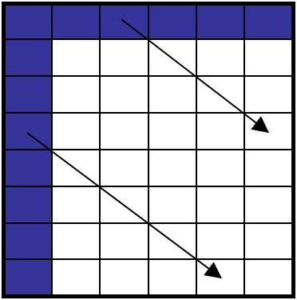
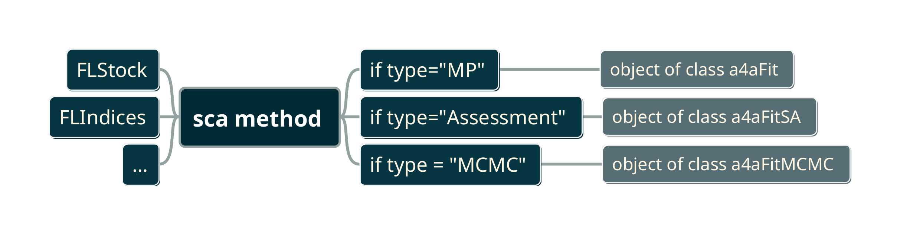

# Stock assessment framework

```{R, message=FALSE, warning=FALSE, echo=FALSE}
# libraries
library(FLa4a)
# datasets
data(ple4)
data(ple4.indices)
data(ple4.index)
```

## Maths description \label{sec:math}

The stock assessment model is based on two types of observations: catches, $\hat{C}$, and abundance indices, $\hat{I}$. The model predicts catches at age $C_{ay}$ and indices of abundance $I_{ays}$ for each age $a$, year $y$ and survey $s$ in the input dataset. To predict catches and survey indices, the model uses the standard population dynamics model

\begin{equation}
N_{a+1,y+1} = N_{ay} \exp \left( - F_{ay} - M_{ay} \right)
\end{equation}


where $N_{ay}$ is the number of individuals at age $a$ in year $y$, $F_{ay}$ is the fishing mortality at age $a$ in year $y$, and $M_{ay}$ is the natural mortality at age $a$ in year $y$.  Any fish that survived beyond the oldest age $A$ in the model are accumulated in the oldest age group and are assumed to be fished at a common rate $F_{A,y}$.

\begin{align}
N_{A,y+1} = &N_{A-1,y} \exp \left( - F_{A-1,y} - M_{A-1,y} \right) \\
            &+ N_{A,y} \exp \left( - F_{A,y} - M_{A,y} \right)
\end{align}

The numbers $N_{a,y}$ are initiated in the first year, $y=1$ and at the youngest age, $a=1$, and the matrix of numbers at age are filled in according to the population dynamics model stated above (see Figure \@ref(fig:popdyn)).

```{r, popdyn, fig.align="center", fig.cap="Statistical catch at age population dynamics model", echo=FALSE, out.width="40%"}

```

Defining $R_y = N_{1,y}$, the numbers at age can be written (ignoring the plus group) as:

\begin{equation}
N_{a,y} = \left\{ \begin{matrix} R_{y-a+1} \exp \left( - \sum^a_{i=1} F_{a-i,y-i} + M_{a-i,y-i} \right) &  y \geq a \\ N_{a-y+1,1} \exp \left( - \sum^{a-y}_{i=1} F_{a-i,y-i} + M_{a-i,y-i} \right) &  y \lt a \end{matrix} \right.
\end{equation}

Catches in numbers by age and year are defined in terms of the three quantities: natural mortality, fishing mortality and recruitment; using a modified form of the well known Baranov catch equation:

\begin{equation}
C_{ay} = \frac{F_{ay}}{F_{ay}+M_{ay}}\left(1 - e^{-(F_{ay}+M_{ay})}\right) R_{y}e^{-\sum (F_{ay} + M_{ay})}
\end{equation}

Survey indices by age and year are defined in terms of the same three quantities with the addition of survey catchability:

\begin{equation}
I_{ays} = Q_{ays} R_{y}e^{-\sum (F_{ay} + M_{ay})}
\end{equation}

It is assumed that the observed catches are normally distributed about the model predictions on the log scale with observation variance $\sigma^2_{ay}$. that is:

\begin{equation}
\log \hat{C}_{ay} \sim \text{Normal} \Big( \log C_{ay}, \sigma^2_{ay}\Big)
\end{equation}

\begin{equation}
\log \hat{I}_{ays} \sim \text{Normal} \Big( \log I_{ays}, \tau^2_{ays} \Big)
\end{equation}

The log-likelihood can now be defined as the sum of the log-likelihood of the observed catches:

\begin{equation}
\ell_C = \sum_{ay} w^{(c)}_{ay}\ \ell_N \Big( \log C_{ay}, \sigma^2_{ay} ;\ \log \hat{C}_{ay} \Big)
\end{equation}

and the log-likelihood of the observed survey indices as:

\begin{equation}
\ell_I = \sum_s \sum_{ay} w^{(s)}_{ays}\ \ell_N \Big( \log I_{ays}, \tau_{ays}^2 ;\ \log \hat{I}_{ays} \Big)
\end{equation}

giving the total log-likelihood

\begin{equation}
\ell = \ell_C + \ell_I
\end{equation}

which is defined in terms of the strictly positive quantities, $M_{ay}$, $F_{ay}$, $Q_{ays}$ and $R_{y}$, and the observation variances $\sigma_{ay}$ and $\tau_{ays}$. As such, the log-likelihood is over-parameterised as there are many more parameters than observations. In order to reduce the number of parameters, $M_{ay}$ is assumed known (as is common).

The remaining parameters are written in terms of a linear combination of covariates $x_{ayk}$, e.g.

\begin{equation}
\log F_{ay} = \sum_k \beta_k x_{ayk}
\end{equation}

where $k$ is the number of parameters to be estimated and is sufficiently small. Using this technique the quantities $\log F$, $\log Q$, $\log \sigma$ and $\log \tau$
%$\log \text{initial\,age\,structure}$ % this is not present in the above
(in bold in the equations above) can be described by a reduced number of parameters. The following section has more discussion on the use of linear models in a4a.

The a4a statistical catch-at-age model can additionally allow for a functional relationship that links predicted recruitment $\tilde{R}$ based on spawning stock biomass and modelled recruitment $R$, to be imposed as a fixed variance random effect. [NEEDS REVISION, sentence not clear]

Options for the relationship are the hard coded models Ricker, Beverton Holt, smooth hockey-stick or geometric mean. This is implemented by including a third component in the log-likelihood:

\begin{equation}
\ell_{SR} = \sum_y \ell_N \Big( \log \tilde{R}_y(a, b), \phi_y^2 ;\ \log R_y \Big)
\end{equation}


giving the total log-likelihood

\begin{equation}
\ell = \ell_C + \ell_I + \ell_{SR}
\end{equation}


Using the (time varying) Ricker model as an example, predicted recruitment is

\begin{equation}
\tilde{R}_y(a_y,b_y) = a_y S_{y-1} e^{-b_y S_{y-1}}
\end{equation}


where $S$ is spawning stock biomass derived from the model parameters $F$ and $R$, and the fixed quantities $M$ and mean weights by year and age. It is assumed that $R$ is log-normally distributed, or equivalently, normally distributed on the log-scale about the (log) recruitment predicted by the SR model $\tilde{R}$, with known variance $\phi^2$, i.e.

\begin{equation}
\log R_y \sim \text{Normal} \Big( \log \tilde{R}_y, \phi_y^2 \Big)
\end{equation}


which leads to the definition of $\ell_{SR}$ given above. In all cases $a$ and $b$ are strictly positive, and with the quantities $F$, $R$, etc. linear models are used to parameterise $\log a$ and/or $\log b$, where relevant.

By default, recruitment $R$ as apposed to the recruitment predicted from a stock recruitment model $\tilde{R}$, is specified as a linear model with a parameter for each year, i.e.

\begin{equation}
\log R_y = \gamma_y
\end{equation}


This is to allow modelled recruitment $R_y$ to be shrunk towards the stock recruitment model. However, if it is considered appropriate that recruitment can be determined exactly by a relationship with covariates, it is possible, to instead define $\log R$ in terms of a linear model in the same way as $\log F$, $\log Q$, $\log \sigma$ and $\log \tau$.  %But this is pretty much the same as taking a geometric mean, with a model on log a, and making the variance very small.

## Model structure \label{sec:submod}

The `a4a` stock assessment framework allows the user to set up a large number of different models. The mechanics which provide this flexibility are designed around the concept of submodels. The user has to define the model structure using `R` formulas, including `mgcv` [@R-mgcv] gam formulas, for each unknown variable that must be estimated. By using `R` formulas the stock assessment framework gives lot's of flexibility to explore models and combinations of submodels.

There are 5 submodels in operation:

- a model for F-at-age ($F_{ay}$)
- a (list) of model(s) for abundance indices catchability-at-age ($Q_{ays}$),
- a model for recruitment ($R_y$)
- a list of models for the observation variance of catch-at-age and abundance indices ($\{\sigma^2_{ay}, \tau^2_{ays}\}$)
- a model for the initial age structure ($N_{a,y=1}$)

When setting the structure of each submodel the user is in fact building the predictive model and its parameters. The optimization process, done through `ADMB`, estimates the parameters and their variance-covariance matrix, allowing further analysis to be carried out, like simulation, prediction, diagnostics, etc. All the statistical machinery will be at the user's reach.

The framework's workhorse is the method `sca`, which is called over `FLStock` and `FLIndex` or `FLIndices` objects. The following code shows an example of a call to `sca()`.

```{r}
# fit a model with a single index
fit <- sca(ple4, ple4.index,
    fmodel = ~ s(age, k = 5),
    qmodel = list(~ s(age, k = 4)),
    srmodel = ~ 1,
    n1model = ~ s(age, k = 5),
    vmodel = list( ~ 1, ~ 1))
# check output
fit
```

The `sca()` method arguments are shown in Table \@ref(tab:scaargs)

|Argument|Default|Description|
|:---|:---|:----------|
|`stock`|`missing`|`FLStock` object containing catch and stock information|
|`indices`|`missing`|`FLIndices` object containing survey indices|
|`fmodel`|`missing`|a formula object depicting the model for log fishing mortality at age|
|`qmodel`|`missing`|a list of formula objects depicting the models for log survey catchability at age|
|`srmodel`|`missing`|a formula object depicting the model for log recruitment|
|`n1model`|`missing`|a formula object depicting the model for the population in the first year of the time series|
|`vmodel`|`missing`|a list of formula objects depicting the model for the variance of fishing mortality and the indices|
|`covar`|`missing`|a list with covariates to be used by the submodels. The formula must have an element with the same name as the list element|
|`wkdir`|`missing`|used to set a working directory for the admb optimiser; if `wkdir` is set, all admb files are saved to this folder, otherwise they are deleted|
|`verbose`|`FALSE`|if `TRUE`, admb fitting information is printed to the screen|
|`fit`|`assessment`|character with type of fit: `assessment` (ML estimation, returns covariance matrix), `MP` (ML estimation, doesn't compute covariance matrix) or `MCMC` (MCMC estimation)|
|`center`|`TRUE`|logical defining if the data should be centered before fitting|
|`mcmc`|`missing`|a `SCAMCMC` object with the arguments to run MCMC fits (`fit=MCMC`)|

Table: (\#tab:scaargs) `sca()` arguments

## Submodel building blocks and fundamental `R` formulas

The elements available to build submodels formulas are 'age' and 'year', which can be used to build models with different structures.

In R's modelling language, a constant model is coded as `~1`, while a slope over time would simply be `~year`, a smoother over time `~s(year, k=10)`, a model with a coefficient for each year would be `~factor(year)`. Transformations of the variables are as usual, e.g. `sqrt(year)`, etc; while combinations of all the above can be done although non-convergence will limit the possibilities.

Using the $F$ submodel as example the following specifies the models described in the previous paragraph, see Figure \@ref(fig:fundforms).

```{r, fundforms, fig.cap="Example of fundamental R formulas used to model the year effect"}
# models
m1 <- ~1
m2 <- ~ year
m3 <- ~ s(year, k=10)
m4 <- ~ factor(year)
m5 <- ~ sqrt(year)

# fits
fit1 <- sca(ple4, ple4.indices, fmodel=m1, fit="MP")
fit2 <- sca(ple4, ple4.indices, fmodel=m2, fit="MP")
fit3 <- sca(ple4, ple4.indices, fmodel=m3, fit="MP")
fit4 <- sca(ple4, ple4.indices, fmodel=m4, fit="MP")
fit5 <- sca(ple4, ple4.indices, fmodel=m5, fit="MP")

# plot
lst <- FLStocks(constant=ple4+fit1,
  linear=ple4+fit2,
  smooth=ple4+fit3,
  factor=ple4+fit4,
  sqrt=ple4+fit5)
lst <- lapply(lst, fbar)
lgnd <- list(points=FALSE, lines=TRUE, space='right')
xyplot(data~year, groups=qname, lst, auto.key=lgnd, type='l', ylab='fishing mortality')
```

The models above and their combinations can be used to model both `age` and `year`. The corresponding fits for age are show in the code below and Figure \@ref(fig:fundformsage).

```{r, fundformsage, fig.cap="Example of fundamental R formulas  used to model the age effect"}
# models
m1 <- ~1
m2 <- ~ age
m3 <- ~ s(age, k=3)
m4 <- ~ factor(age)
m5 <- ~ sqrt(age)

# fits
fit1 <- sca(ple4, ple4.indices, fmodel=m1, fit="MP")
fit2 <- sca(ple4, ple4.indices, fmodel=m2, fit="MP")
fit3 <- sca(ple4, ple4.indices, fmodel=m3, fit="MP")
fit4 <- sca(ple4, ple4.indices, fmodel=m4, fit="MP")
fit5 <- sca(ple4, ple4.indices, fmodel=m5, fit="MP")

# plot
lst <- FLStocks(constant=ple4+fit1,
  linear=ple4+fit2,
  smooth=ple4+fit3,
  factor=ple4+fit4,
  sqrt=ple4+fit5)
lst <- lapply(lst, function(x) harvest(x)[,'2000'])
xyplot(data~age, groups=qname, lst, auto.key=lgnd, type='l', ylab='fishing mortality in 2000')
```

## The major effects available for modelling

Although the building blocks for formulas are `age` and `year`, in fact there are three effects that can be modelled for each submodel: `age`, `year` and `cohort`. As examples note the following models for fishing mortality.

```{r}
# the age effect
ageeffect <- ~ factor(age)

# the year effect
yeareffect <- ~ factor(year)

# the cohort
cohorteffect <- ~ factor(year-age)

# the fits
fit1 <- sca(ple4, ple4.indices, fmodel=yeareffect)
fit2 <- sca(ple4, ple4.indices, fmodel=ageeffect)
fit3 <- sca(ple4, ple4.indices, fmodel=cohorteffect)
```

and the graphical representation of the three models in Figures \@ref(fig:majeffy) to \@ref(fig:majeffc).

```{r, majeffy, fig.cap="Major effects: the year effect (~ factor(year))", echo=FALSE}
wireframe(harvest(fit1), main='year effect')
```

```{r, majeffa, fig.cap="Major effects: the age effect (~ factor(age))", echo=FALSE}
wireframe(harvest(fit2), main='age effect')
```

```{r, majeffc, fig.cap="Major effects: the cohort effect (~ factor(year-age))", echo=FALSE}
wireframe(harvest(fit3), main='cohort effect')
```

## Classes Description \label{sec:classes}

The data structure used to store and report the fitting process follows an object-oriented paradigm (e.g. the S4 system in R) and is hierarchically organized. The `type` argument in the `sca` method defines the fitting method - either maximum likelihood or MCMC - and specifies whether the variance-covariance matrix of the parameters is calculated and returned in the case of maximum likelihood. The resulting object belongs to a specific class, depending on the selected option. Figure \@ref(fig:iomod) illustrates the input/output model of the statistical stock assessment method based on catch-at-age data.


```{r, iomod, fig.align="center", fig.cap="The fit process input/output model", echo=FALSE, out.width="120%"}

```

Table \@ref(tab:scatype) provides details about the type of fit approach and computation of variance covariance information.

|Type of Fit|Fit Method|Variance-Covariance Matrix|Output Object Class|
|:--|:--|:--|:--|
|`MP`|Maximum Likelihood|No|`a4aFit`|
|`assessment`|Maximum Likelihood|Yes|`a4aFitSA`|
|`MCMC`|MCMC|No|`a4aFitMCMC`|
Table: (\#tab:scatype) Fit Types and Associated Classes

Type `MP`, for "Management Procedure," returns an `a4aFit` class object designed for use in MSEs (Management Strategy Evaluations) with full feedback models [@puntmse]. Inverting the jacobian to compute the variance-covariance matrix is computationally intensive in maximum likelihood models, and as MSE analyses often involve thousands of iterations, using `fit="MP"` significantly speeds up the process. This option is advantageous for scenarios requiring multiple model fits. However, the lack of immediate feedback on model convergence is a drawback, as convergence is assessed by inverting the Jacobian. A failed inversion indicates non-convergence.

Type `assessment`, the default, reports both the parameters and their variance-covariance, and as such requires the inversion of the hessian matrix. The method takes longer to run but returns a much richer dataset which allows the computation confidence intervals, simulate, etc. When the hessian matrix can't be inverted this method flags potential non-convergence and returns an empty object.

Type `MCMC` uses the Markov Chain Monte-Carlo approach, in which case it doesn't compute likelihoods or variance-covariance matrices. It returns the full draws of the chain, which allows the computation of credible intervals, simulation kind of studies and so on.

Table \@ref(tab:a4afitclass) describes the composition of the `a4aFit` class.

|Class|Slot|Slot's Class|Description|
|:--|:--|:--|:--|
|`a4aFit`|`call`|`call`|Code used to run the analysis|
| |`catch.n`|`FLQuant`|Catch numbers at age and year|
| |`clock`|`numeric`|Time to run the analysis|
| |`desc`|`character`|Description of the stock and/or analysis|
| |`fitSumm`|`array`|Summary statistics of the fit (e.g., number of data points)|
| |`harvest`|`FLQuant`|Fishing mortality at age and year|
| |`index`|`FLQuants`|Indices of abundance (age/biomass, by year)|
| |`name`|`character`|Stock name|
| |`range`|`numeric`|Age and year range of the data|
| |`stock.n`|`FLQuant`|Population in numbers (age and year)|
Table: (\#tab:a4afitclass) `a4aFit` Class Description

The `a4aFitSA` and `a4aFitMCMC` classes extend `a4aFit`, retaining all its slots while adding a `pars` slot of class `SCAPars`. Table \@ref(tab:a4afitSAclass) outlines these classes.

|Class|Slot|Slot's Class|Description|
|:--|:--|:--|:--|
|`a4aFitSA`|All `a4aFit`||Inherited from `a4aFit`|
| |`pars`|`SCAPars`|Parameter information|
|`a4aFitMCMC`|All `a4aFit`||Inherited from `a4aFit`|
| |`pars`|`SCAPars`|Parameter information|
Table: (\#tab:a4afitSAclass) `a4aFitSA` and `a4aFitMCMC` Class Description

The `SCAPars` class stores details about submodel parameters, such as formulas and distributions, and includes three slots: `stkmodel` for stock model parameters, `qmodel` for catchability parameters, and `vmodel` for variance parameters. Table \@ref(tab:SCAParsclass) describes the `SCAPars` class.

|Class|Slot|Slot's Class|Description|
|:--|:--|:--|:--|
|`SCAPars`|`stkmodel`|`a4aStkParams`|Details of fishing mortality, stock recruitment, and initial stock numbers|
| |`qmodel`|`submodel`|Details of catchability parameters|
| |`vmodel`|`submodel`|Details of variance parameters|
Table: (\#tab:SCAParsclass) `SCAPars` Class Description

The `stkmodel` slot encompasses parameters for fishing mortality, stock recruitment, and initial stock numbers. Due to potential correlations among these parameters, their variance-covariance matrix is reported collectively. Table \@ref(tab:a4aStkParamsclass) describes the slots of the `a4aStkParams` class.

|Class|Slot|Slot's Class|Description|
|:--|:--|:--|:--|
|`a4aStkParams`|`centering`|`FLPar`|Centering parameters|
| |`coefficients`|`FLPar`|Model coefficients|
| |`desc`|`character`|Description|
| |`distr`|`character`|Distributions|
| |`fMod`|`formula`|Fishing mortality model|
| |`link`|`function`|Link function|
| |`linkinv`|`function`|Inverse link function|
| |`m`|`FLQuant`|Mortality parameters|
| |`mat`|`FLQuant`|Maturity parameters|
| |`n1Mod`|`formula`|Initial stock numbers model|
| |`name`|`character`|Stock name|
| |`range`|`numeric`|Age and year range|
| |`srMod`|`formula`|Stock-recruitment model|
| |`units`|`character`|Units of measurement|
| |`vcov`|`array`|Variance-covariance matrix|
| |`wt`|`FLQuant`|Weights|
Table: (\#tab:a4aStkParamsclass) `a4aStkParams` Class Description

The `qmodel` and `vmodel` slots share the `submodel` class, which describes single submodels. Table \@ref(tab:submodelclass) provides details.

|Class|Slot|Slot's Class|Description|
|:--|:--|:--|:--|
|`submodel`|`centering`|`FLPar`|Centering parameters|
| |`coefficients`|`FLPar`|Model coefficients|
| |`desc`|`character`|Description|
| |`distr`|`character`|Distributions|
| |`formula`|`formula`|Submodel formula|
| |`link`|`function`|Link function|
| |`linkinv`|`function`|Inverse link function|
| |`name`|`character`|Stock name|
| |`range`|`numeric`|Age and year range|
| |`vcov`|`array`|Variance-covariance matrix|
Table: (\#tab:submodelclass) `submodel` Class Description


