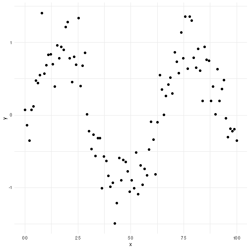
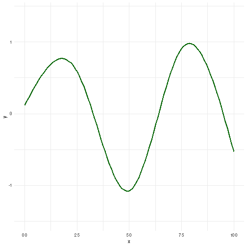
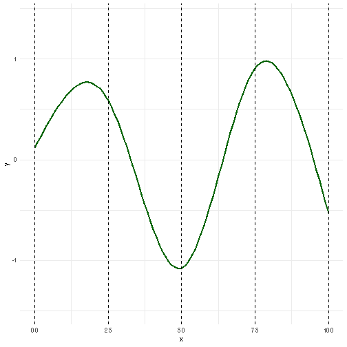
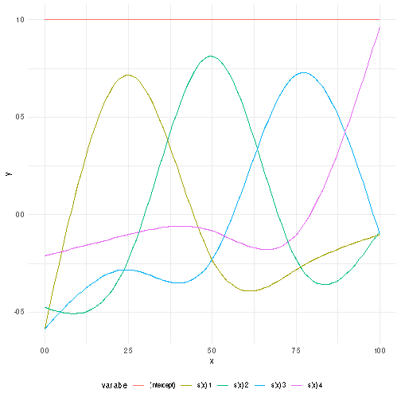
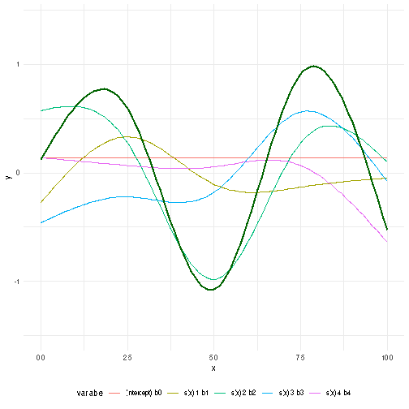
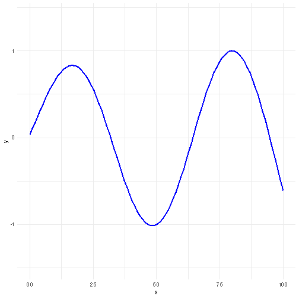
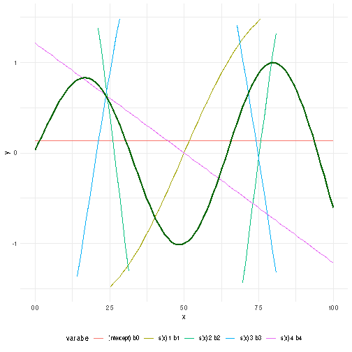
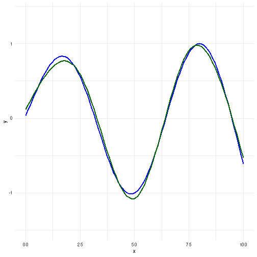
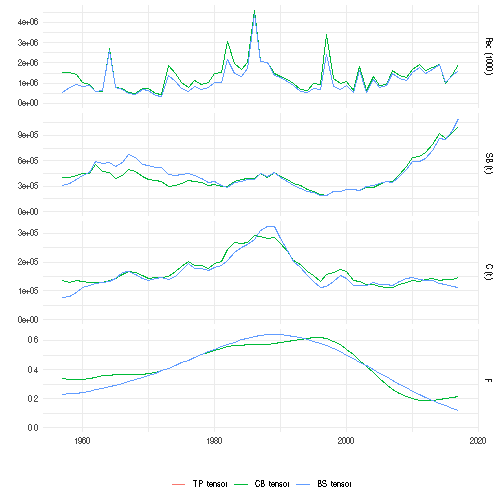
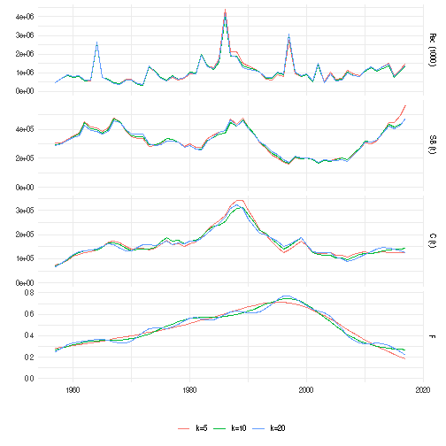

### Introduction to Splines

Splines are a powerful tool for modeling complex, non-linear relationships between variables in a flexible and interpretable way. They break a function into smooth, continuous polynomial segments, each called a *piece* or *basis function*, joined at specific points called *knots*. This piecewise approach allows us to capture the non-linearity in the data without overfitting.

The core concept of "basis functions" is that they transform the input variable (or vector) $X$ into a set of new variables, which are then used as inputs in the model. This allows the model to remain linear in these transformed variables, even though it can capture complex, non-linear relationships in the original variable.

### Understanding Spline Basics

The spline function is built by combining polynomial pieces, ensuring smoothness at the junctions, which are called knots. In regression, splines allow us to fit complex shapes by introducing non-linear trends while maintaining control over the smoothness.

A simplified version of how splines work would be as follows:

Let $S$ our spline function, that is defined in an interval $[a,b]$. We seek to construct $S$ by combining $k-1$ polynomials $P$, where $k$ is the number of knots. Let also $t_{i}, i = 0, ..., k-1$ the positions of the knots in the interval $[a,b]$.

$S$ is going to be defined as:

$$
S(t) = P_{0}(t), \quad t_{0} \leq t < t_{1} \\
\vdots \\
S(t) = P_{k-1}(t), \quad t_{k-1} \leq t < t_{k}
$$

The above definition is a simplified version of how splines work and can help as an intuitive approach. In reality splines need to satisfy some extra conditions like continuity on the points of junction, and of the first and second derivative. Depending on the basis functions the conditions may differ. The next part will demonstrate graphically how to approximate an unknown function through splines.

### Generate some artificial data


``` r
x <- seq(0, 10, length.out = 100)
y <- sin(x) + rnorm(100, 0, 0.3)
data <- data.frame(x, y)
ggplot(data, aes(x, y)) + 
  geom_point()
```



We will use the package `mgcv` which is the one that is being used in `a4a`.

### Cubic Regression Splines

We fit a simple smoother on x with $k = 5$:


``` r
# Fit a natural cubic spline with ns()
cr_model <- gam(y ~ s(x, bs = "cr", k = 5), data = data)

# Predict and plot
data$cr_fit <- predict(cr_model)

ggplot(data, aes(x, y)) +
  geom_point(alpha = 0.4) +
  geom_line(aes(y = cr_fit), color = "darkgreen", linewidth = 1)
```

```
## Warning in grid.Call.graphics(C_points, x$x, x$y, x$pch, x$size):
## semi-transparency is not supported on this device: reported only once per page
```



The natural cubic spline fit above is constrained at the boundaries, by putting two of the five knots there, resulting in a linear behavior at the ends of the data range. This approach is helpful for data that has an approximately linear trend at the boundaries but exhibits non-linearity in the center.

The knots in the cubic regression splines are placed by quantile through the variable space, so in the case where the data are evenly spread across the variable space the knots will be placed evenly.


```
## Warning in grid.Call.graphics(C_points, x$x, x$y, x$pch, x$size):
## semi-transparency is not supported on this device: reported only once per page
```



The `gam` routine creates $k-1$ polynomials plus an intercept based on the knots:



The polynomials transform the initial variable $x$ and create a *model* matrix $X$ with $k$ columns and $n$ rows, where $n$ is the number of data points. This new transformation is being then used to fit the model and estimate the $\beta_{0}, ... ,\beta_{k-1}$ coefficients. The fitted model results from $X\beta$


``` r
ggplot(data = df_xm_basis_b, aes(x = x, y = value, group = variable, colour = variable)) +
  geom_line() + geom_line(aes(y = fitted), color = "darkgreen", linewidth = 1)+
  geom_point(aes(y = obs), color = "darkgrey", alpha = 0.4)+ theme(legend.position="bottom")+ylab("y")
```

```
## Warning in grid.Call.graphics(C_points, x$x, x$y, x$pch, x$size):
## semi-transparency is not supported on this device: reported only once per page
```



### Thin plate spline

Thin plate splines are particularly useful for smoothing in multiple dimensions. However, they also work well with univariate data, as they offer flexibility and control over smoothness they are the default choice of the `mgcv` package.


``` r
# Fit a thin plate spline with gam()
tps_model <- gam(y ~ s(x, k = 5, bs = "tp"), data = data)

# Predict and plot
data$tps_fit <- predict(tps_model)

ggplot(data, aes(x, y)) +
  geom_point(alpha = 0.4) +
  geom_line(aes(y = tps_fit), color = "blue", linewidth = 1)
```

```
## Warning in grid.Call.graphics(C_points, x$x, x$y, x$pch, x$size):
## semi-transparency is not supported on this device: reported only once per page
```



This spline automatically adjusts its flexibility across the data, with a smoothing penalty that controls the degree of bending. Thin plate splines are ideal when you need a smooth fit without predefined knots. The knots in thin plate splines are not positioned across the variable space, instead, by default, when no knot number is specified, there are as many knots as data points which essentially define the number of basis splines. 

In the case where $k$ is specified the thin plate splines use the first $k$ "principal components" in a similar way as the PCA algorithm works.


As in the example before, the fitted model results from $X\beta$


``` r
ggplot(data = df_xm_basis_b, aes(x = x, y = value, group = variable, colour = variable)) +
  geom_line() + geom_line(aes(y = fitted), color = "darkgreen", linewidth = 1)+
  geom_point(aes(y = obs), color = "darkgrey", alpha = 0.4)+
  theme(legend.position="bottom")+ylab("y")+
  scale_y_continuous(limits = c(-1.5,1.5))
```

```
## Warning: Removed 122 rows containing missing values or values outside the scale range
## (`geom_line()`).
```

```
## Warning in grid.Call.graphics(C_points, x$x, x$y, x$pch, x$size):
## semi-transparency is not supported on this device: reported only once per page
```



### Comparison

Plotting together thin plate spline and cubic spline fits with the same number of knots.


``` r
ggplot(data, aes(x, y)) +
  geom_point(alpha = 0.4) +
  geom_line(aes(y = tps_fit), color = "blue", linewidth = 1) +
  geom_line(aes(y = cr_fit), color = "darkgreen", linewidth = 1)+
  labs(color = "Spline Type") +
  scale_color_manual(values = c("blue", "darkgreen"))
```

```
## Warning in grid.Call.graphics(C_points, x$x, x$y, x$pch, x$size):
## semi-transparency is not supported on this device: reported only once per page
```




### The `mgcv` package inside `a4a`


The `mgcv` package provides various user input options to define the smoother functions used to construct the submodels.

Under the `a4a` framework, the `mgcv` package is used to construct the model matrices of the submodels, which are then passed to the `ADMB` where the model fitting takes place. 

The default option for the basis functions of the splines is `bs = tp` (thin plate splines) and is considered the optimal option. The user can define other smoothing basis functions using the `bs` argument. The user can refer to the `smooth.terms` of the `mgcv` package for a full description. There are many equivalent basis functions for the splines, and some of them have little or no effect in the context of `a4a`, since they differ only in the penalty term, which is not used in `a4a`.

Examples for different smoothing terms:


``` r
fmod00 <- ~s(age)+s(year, bs = 'tp', k = 10) # thin plate splines
fmod01 <- ~s(age)+s(year, bs = 'cr', k = 10) # regression cubic splines
fmod02 <- ~s(age)+s(year, bs = 'bs', k = 10) # b-splines
fmod03 <- ~s(age)+s(year, bs = 'ps', k = 10) # p-splines
fmod04 <- ~s(age)+s(year, bs = 'ad', k = 10) # Adaptive smoothers

fit00 <- sca(stk, idx, fmodel = fmod00)
fit01 <- sca(stk, idx, fmodel = fmod01)
fit02 <- sca(stk, idx, fmodel = fmod02)
fit03 <- sca(stk, idx, fmodel = fmod03)
fit04 <- sca(stk, idx, fmodel = fmod04)
```

In this example we are using the thin plate regression splines, cubic splines, b-splines, p-splines and adaptive smoothers


``` r
plot(FLStocks(ThinPlate = stk + fit00,
              CubicRegressionSplines = stk + fit01,
              B_splines = stk + fit02,
              P_splines = stk + fit03,
              Adaptive_smoothers = stk + fit04
              ))+theme(legend.position = 'bottom')
```

```
## Warning in grid.Call.graphics(C_polygon, x$x, x$y, index): semi-transparency is
## not supported on this device: reported only once per page
```


Functionality of `mgcv` package provides also the option to work with interactions. Although `s(age, year)` can be defined, it uses a common bivariate spline for the two variables which are very different in scale. It is preferable if interactions are assumed to use `te(age, year)`. Again is up to the user to define the basis functions for the smoothers.


``` r
fmod03 <- ~te(age, year, k = c(3,10))
fmod04 <- ~te(age, year, k = c(3,10), bs = 'cr')
fmod05 <- ~te(age, year, bs = 'bs')

fit03 <- sca(stk, idx, fmodel = fmod03)
fit04 <- sca(stk, idx, fmodel = fmod04)
fit05 <- sca(stk, idx, fmodel = fmod05)
```


``` r
plot(FLStocks(TP_tensor = stk + fit03,
              CB_tensor = stk + fit04,
              BS_tensor = stk + fit05))+theme(legend.position = 'bottom')
```

```
## Warning in grid.Call.graphics(C_polygon, x$x, x$y, index): semi-transparency is
## not supported on this device: reported only once per page
```



## On the number of knots $k$

$k$ is the dimension of the basis used to represent the smooth term $s$. The default depends on the number of variables that the smooth is a function of. In practice k-1 (or k) sets the upper limit on the degrees of freedom associated with an s smooth (1 degree of freedom is usually lost to the intercept of the smooth). For the smooths the upper limit of the degrees of freedom is given by the product of the k values provided for each marginal smooth less one, for the constraint. The choice of the k is not critical and in general it must be large enough to allow to have enough degrees of freedom capturing the underlying process and small enough to prevent overfitting. A strong pattern in the residuals can be a sign of low $k$.


``` r
fmod00 <- ~s(age)+s(year, k = 5) 
fmod01 <- ~s(age)+s(year, k = 10) # cubic splines
fmod02 <- ~s(age)+s(year, k = 20) # b-splines

fit00 <- sca(stk, idx, fmodel = fmod00)
fit01 <- sca(stk, idx, fmodel = fmod01)
fit02 <- sca(stk, idx, fmodel = fmod02)

plot(FLStocks('k=5' = stk + fit00,
              'k=10' = stk + fit01,
              'k=20' = stk + fit02))+theme(legend.position = 'bottom')
```

```
## Warning in grid.Call.graphics(C_polygon, x$x, x$y, index): semi-transparency is
## not supported on this device: reported only once per page
```



We can check the result of choosing different $k$ values on BIC and GCV:


``` r
# fmodsk <- list()
# for(i in 10:20) {
#   fmodsk[[paste0(i)]] <- as.formula(paste0("~s(age)+s(year, k=",i,")"))
# }

# myFits <- FLa4a::multisca(stk, idx, fmodel = fmodsk)
# plot(myFits)
```

